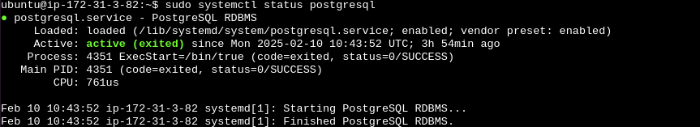
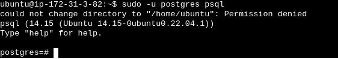
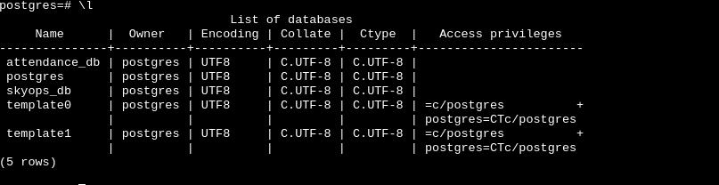
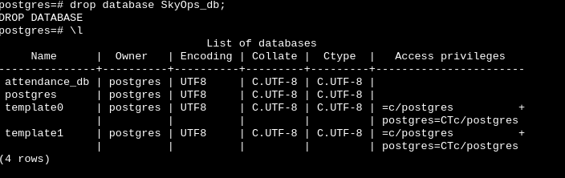

# POSTGRES INSTALLATION POC


| **Author** | **Created on** | **Version** | **Last edited on** | **Reviewer** |
|------------|----------------|-------------|--------------------|--------------|
| Sheetal    | 10-02-2025     | Version 1   | 10-02-2025         | Siddhart Pawar |
   

**Table of Contents**                               

[Introduction]( #introduction)  
   
[Step-by-Step Setup Guide](#step-by-step-setup-guide)

[Contact Information](#contact-information)  
   
[References](#references)                               


## Introduction

PostgreSQL is a relational SQL database that organizes data into rows and columns. It was created in 1986 by the University of California, Berkeley. Today, it is utilized by numerous organizations, including companies like Uber, Netflix, Reddit, Salesforce, and Toshiba.


## Step-by-Step Setup Guide 

### Install Postgres on Ubuntu.
We can install PostgreSQL on **ubuntu** with the help of the following commands.

#### Step 1 : sudo apt update

**Explanation**: This command fetches the latest package information from the software repositories listed in your system. 

**NOTE**: This command does not install or upgrade any software—it only updates the list of available packages and their versions.

#### STEP 2 : install from [official website](https://www.postgresql.org/download/)

To install postgres directly with apt command

```
sudo apt install postgresql postgresql-contrib -y
```
**Explanation**

**postgresql**: This is the main package for installing PostgreSQL.

**postgresql-contrib**: This package contains additional utilities and extensions for PostgreSQL.

**-y**: This option automatically confirms the installation of the packages without prompting you to accept or reject the installation.
 
#### STEP 3 : To verify the installation and check the version of postgres

```
psql --version
```


#### STEP 4 :  To start, enable, and check the status of PostgreSQL
```
sudo systemctl start postgresql
```

```
sudo systemctl enable postgresql
```
```
sudo systemctl status postgresql
```





#### STEP 5 : Now switch into postgres user with the help of the below command.
```
sudo -u postgres psql
```
**Explanation**

**-u**: Flag is used to indicate the user to execute the command as.Here, it is postgres.

**psql**: This is the PostgreSQL command-line tool used to interact with a PostgreSQL database.





#### STEP 6 : To create a database follow the below command. 

```
create database database_name
```
For example, I am creating a database called `SkyOps_db`,:
```
CREATE DATABASE SkyOps_db;

```


### We can list the created database with the help of the below command.

```
\l
```



### We can also delete a particular database with the help of the below command.

```
drop database database_name
```
To delete the database Skyops, that we created earlier. We can follow this commans:
```
drop database SkyOps_db;
```




## Contact Information 

| Name| Email Address      |
|-----|--------------------------|
| Sheetal | sheetal.nain@mygurukulam.co |


## References
| Links | Description |
|-------|-------------|
| [Postgres installation](https://help.ubuntu.com/community/PostgreSQL) | Postgres installation |
| [Postgres configuration](https://ubuntu.com/server/docs/install-and-configure-postgresql)  | To configure Postgres as per your requirement |


